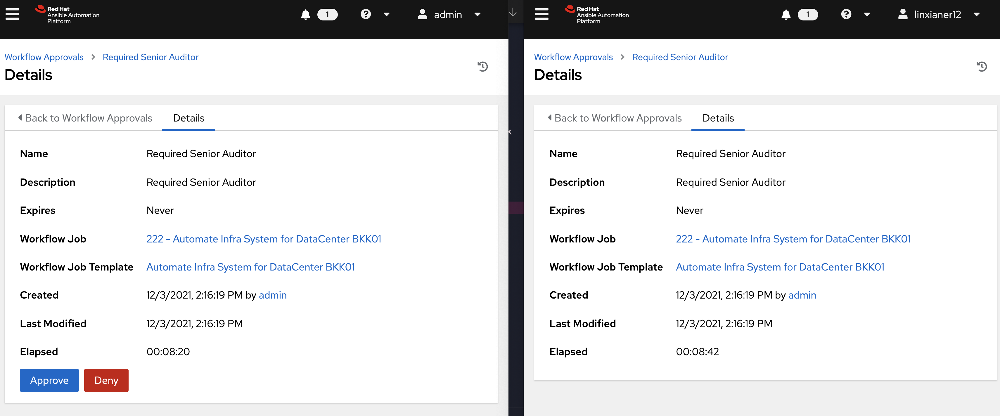

# Ansible Window Splunk Universal Forwarder Integration

ภาพรวมของ Architecture ที่ใช้งาน

นปัจจุบันถ้าเราอยากจะลงโปรแกรมหลายๆเครื่องใน Window หรือไปใช้คำสั่งอะไรบางอย่างก็อาจจะต้องกด GUI Next ๆไป ถ้าหากงานนั้นทำไม่บ่อยก็คงไม่ค่อยเหนื่อยเท่าไหร่ แต่ถ้าเกิดเป็นงานที่ต้องรันบ่อยๆการไปกดผ่านหน้าจอหรือพิมพ์ทีล่ะคำสั่งใน Powershell ก็อาจจะช้าหรือเกิดความผิดพลาดได้ซึ่งการที่เรามี Automation Tool อย่าง Ansible มาช่วยก็จะทำให้เราสามารถทำงานเดิมซ้ำๆได้ และคนใหม่ที่มาเข้าร่วมทีมก็สามารถนำ Logic เดิมที่มีอยู่ไปใช้งานได้เลย
Ansible สามารถไปติดต่อกับ Module ต่างๆได้หลากหลายทั้ง Window, Linux, อุปกรณ์ Network อื่นๆอีกมากมายซึ่งความรู้ที่เราใช้ก็จะถูกแปลงอยู่ในรูปแบบของ Code ทำให้เราสามารถตามไปรีวิวและตรวจสอบกันได้ไม่ต้องกังวลว่าองค์ความรู้จะหายไปเพราะไมไ่ด้ทำนานๆแล้วเกิดลืมขึ้นมา โดยตัว Source Code จะนำไปสู่การสื่อสารในทีมเพื่อแบ่งปันความรู้ให้ทุกๆคนอีกด้วยเพราะในองค์กรก็อาจจะมีพี่ๆที่เชี่ยวชาญในด้านของ System ที่ตัวเองดูแลอย่างในภาพคนที่เป็น Domain Expert ในการลง Splunk ก็อาจจะรู้ว่าเวลาที่เราลง Splunk เสร็จเรามีความจำเป็นที่จะต้อง Accept License ผ่าน Command หรือ Restart Service ซึ่งการที่จะทำได้ก็ต้องมี PATH Environment ที่ชี้ไปหา Binary ของ Splunk ใน Window ทำให้ถ้าบาง Task ที่เราลืมบันทึกในคุ่มือการติดตั้ง คนที่มาร่วมงานใหม่ก็อาจจะไม่ทราบว่าต้องทำอย่างไรและด้วย Step การพิมพ์ Manual ก็ส่งผลให้มีโอกาสพลาดมากขึ้นนั่นเอง ดั่งนั้นวันนี้เราจะมาดูตัวอย่างการติดตั้ง Splunk ด้วย Ansible กัน ~

### 1. เงื่อนไขพื้นฐานในการใช้ Ansible กับ Window Server
ในการ Setup Ansible ให้สามารถทำงานกับ Window นั้นมีความจำเป็นมากกว่า Linux เพิ่มเติมนิดหน่อยคือปกติแล้ว Window Server นั้นไม่ได้ใช้งาน SSH Services แต่ใช้เป็นการ Remote ผ่าน WinRM Protocol แทนซึ่ง WinRM นั้นจำเป็นที่จะต้องทำงานผ่าน Port 5985 หรือ 5986
[อ้างอิง WinRM Port](https://docs.microsoft.com/en-us/windows/win32/winrm/installation-and-configuration-for-windows-remote-management#windows-firewall-and-winrm-20-ports)


ซึ่ง Ansible มีความจำเป็นที่ใช้เวอร์ชั่นอัพเดทล่าสุดของ Powershell เพิ่มเติมดังนั้นแล้วหากเพื่อนคนไหนลองใช้ Ansible ต่อเข้าไปแล้วเกิด Error ตลอดก็ให้นำ Script Powershell นี้ไปรันไว้ก่อนที่เครื่องนั้น โดยใน git proejct นี้เราได้นำไฟล์ที่จำเป็นในการรันไว้ให้แล้วชื่อไฟล์ว่า `enable-ansible-to-window.ps1` ให้ Copy ไปวางที่เครื่อง Window Server ปลายทางและสั่งรัน Powershell script นี้ผ่าน Powershell Terminal

[อ้างอิง Script ที่จำเป็นในการอัพเดท Powershell Module ให้รองรับ Ansible](https://docs.ansible.com/ansible/latest/user_guide/windows_setup.html#winrm-setup)


แต่ Config และ Playbook ตัวนี้ยังไม่ได้มีการใช้เทคนิคจัดการเรื่องของ Credentials อย่างเต็มรูปแบบถ้าหากนำไปใช้เพื่อนๆอย่างลืมแก้ไข Config ให้เหมาะสมกับ Environment ในงานของตัวเองด้วยนะ ~

---

### 2. เตรียม Config และ Variable ที่จำเป็นสำหรับคนรัน Ansible Engine ผ่านคอมพิวเตอร์ตัวเอง

Ansible Engine ที่เป็นตัวสั่งควบคุมเครื่องปลายทางให้ทำงานตาม Playbook ที่เขียนไว้นั้นจำเป็นที่จะต้องใช้ OS ประเภท Linux, Unix, Solaris ที่รองรับดังนี้ ซึ่งถึงแม้เราจะไม่สามารถลงตัว Ansible Engine โดยตรงที่ Window ได้แต่เราสามารถลงใน Window WSL2 แล้วใช้งานได้เหมือนกันเลย ~ 


เมื่อเราลง Ansible Engine เรียบร้อยแล้วให้ทดสอบด้วยการพิมพ์คำสั่ง `ansible --version ` เราควรที่จะเห็นผลลัพธ์คล้ายๆดั่งนี้
```
ansible [core 2.11.6] 
  config file = /Users/supakorn.t/.ansible.cfg
  configured module search path = ['/Users/supakorn.t/.ansible/plugins/modules', '/usr/share/ansible/plugins/modules']
  ansible python module location = /usr/local/Cellar/ansible/4.8.0/libexec/lib/python3.10/site-packages/ansible
  ansible collection location = /Users/supakorn.t/.ansible/collections:/usr/share/ansible/collections
  executable location = /usr/local/bin/ansible
  python version = 3.10.0 (default, Oct 22 2021, 13:39:57) [Clang 13.0.0 (clang-1300.0.29.3)]
  jinja version = 3.0.2
  libyaml = True
```
#### 2.1 เพิ่ม Host และ Credentials ที่ใช้ในการต่อไป Window Server ปลายทาง

เนื่องจาก Ansible นั้นมีความยืดหยุ่นในเรื่องของการใช้ตัวแปรได้หลายระดับมากทั้งตั้งแต่การ Hardcode ลงไปใน Playbook จนถึงสร้างตัวแปร High Level ขึ้นมาเพื่อให้เกิดความยืดหยุ่นเช่นตัวแปรใช้ตาม Group ของ Server ที่เราตั้งชื่อกลุ่มไว้ก็ทำได้เช่นกัน[อ้างอิงลำดับการตัวแปรของ Ansible](https://docs.ansible.com/ansible/latest/user_guide/playbooks_variables.html)

ดังนั้นตัวอย่างในการ Setup นี้เราจะค่อยๆเริ่มจากการตั้งตัวแปรเพื่อต่อไปยัง Host ของ Window Server ที่ถูกจัดกลุ่มรวมกันแล้วตั้งชื่อกลุ่มของเครื่องเหล่านี้ว่า `Window`

##### ไฟล์และโฟล์เดอร์ที่จำเป็นในเครื่องคนรัน Ansible Engine

1) `~/.ansible.cfg` สำหรับการระบุตัวแปร Ansible Runtime ต่างๆโดย Inventory คือการระบุตำแหน่งของ Host ไฟล์ที่จะต้องใช้ก็ให้เพื่อนๆแก้ไปตำแหน่งที่ถูกต้องของคอมพิวเตอร์ตัวเองนะ
```
[defaults]
inventory = /Users/supakorn.t/ansible/hosts
```

2) `~/ansible/hosts` ระบุเครื่องปลายทางเช่น IP หรือ Domain โดยสัญลักษณ์ปีกกาเหลี่ยมคือชื่อกลุ่มนั่นเอง `[ชื่อกลุ่ม]`
```
[window]
119.xx.xx.xx
119.xx.xx.xx
```
3) `~/ansible/group_vars/window.yaml`  ชื่อไฟล์ใน directory นี้จะต้องตรงกับชื่อ `[ชื่อกลุ่ม]`กลุ่มในไฟล์ `~/ansible/hosts` 
```
ansible_user: <<User เครื่องปลายทาง ตัวอย่างนี้ใช้ Administrator>>

ansible_password: <<รหัสผ่านเครื่องแอดมินหรือผู้ใช้คนนั้น>>

ansible_connection: winrm

ansible_winrm_server_cert_validation: ignore

ansible_winrm_transport: basic
```
ระบุตัวแปรที่ใช้ในกลุ่มของเครื่อง Host ที่ถูกจัดกลุ่มแล้ว
เวลาที่ Ansible ทำงานนั้นจะทำการมาอ่านไฟล์ `ansible.cfg` โดยสำหรับโปรเจคนี้เราจะมีการ Setup ดั่งนี้แต่เพื่อนๆก็สามารถทดลองไปปรับเปลี่ยนได้นะโดยดูได้จากลิ้งค์ที่แปะไว้
[อ้างอิงการตั้งค่า ansible.cfg](https://docs.ansible.com/ansible/latest/reference_appendices/config.html#ansible-configuration-settings)

โดยปกติแล้วเราอาจจะไม่มี File หรือ Directory ที่จำเป็นต้องใช้ทั้งสามตัว ดังนั้นให้เพื่อนๆสร้างขึ้นมาตามลำดับโดยข้างในจะมี Config ดั่งนี้ (อย่าลืมว่าตอนนี้เรากำลังทำใน WSL2 ของ Window นะแต่ถ้าใครใช้ Linux อยู่แล้วก็ไม่มีปัญหาทำต่อไปได้เบย)


#### 2.2 การทำตัวแปรสำหรับ Playbook เพื่อให้เกิดความหยืดหยุ่น
ตัวอย่างนี้มีการใช้เทคนิคส่ง Variable ลงไปเพื่อให้เราไม่จำเป็นต้องไปแก้ Source Code ของ Playbook ทุกครั้งซึ่งจะมี Structure ของไฟล์ที่จำเป็นต้องแก้ไขดั่งนี้

1. `install-file/splunkclouduf.spl` คือไฟล์ License ของ Splunk ให้เราไปขอทดลองโหลด License มาวางไว้ที่ตำแหน่งนี้ **วิธีนี้ไม่ได้ปลอดภัยแต่อย่างใด** เพราะไฟล์ License ถ้าสำคัญมากๆเรอาจจะควรที่จะแยกไปเก็บไว้ใน Storage พิเศษที่ต้องใช้ token หรือการ Authentication ในการ Download ไฟล์มาติดตั้งเพื่อไม่ให้ทุกคนสามารถเอา License ไปใช้ตามชอบได้นะ 
2. `automation/roles/install_va_tool/defaults/main.yml`
```
splunk_license_location: <ตำแหน่งกับชื่อไฟล์ License | install-file/splunkclouduf.spl>
splunk_server: "yyyyy.splunkcloud.com:8089"
splunk_username: admin
splunk_password: <รหัสผ่าน>
application_installer_target_dest: "<ตำแหน่งของ License ไฟล์ที่จะไปวางในเครื่องปลายทาง | C:/Users/Administrator>"
```
ในการทดสอบการรันโปรเจคถ้าหากใครใช้ WSL2 หรือ Linux อยู่แล้วให้สั่งรันได้เลยแต่ถ้าเกิด Crash ขึ้นให้ทำการ export ตัวแปรนี้ลงไปใน Terminal โดยเฉพาะ MacOS ตัวอย่าง Error ที่จะเกิดขึ้น
```
redirecting (type: modules) ansible.builtin.setup to ansible.windows.setup
objc[20651]: +[__NSCFConstantString initialize] may have been in progress in another thread when fork() was called.
objc[20651]: +[__NSCFConstantString initialize] may have been in progress in another thread when fork() was called. We cannot safely call it or ignore it in the fork() child process. Crashing instead. Set a breakpoint on objc_initializeAfterForkError to debug.
```
[อ้างอิง multiple_parallel_winrm_connections_crashes_winrm](https://www.reddit.com/r/ansible/comments/7768c5/multiple_parallel_winrm_connections_crashes_winrm/)

```
export OBJC_DISABLE_INITIALIZE_FORK_SAFETY=YES
````
ทดสอบการเชื่อมต่อไปยังเครื่องปลายทางด้วยคำสั่ง
```
ansible-playbook -vv send-connection.yml
```
เราจะพบ Error นี้ก็เพราะว่าใน file Tasks `automation/roles/install_va_tool/tasks/debug-connection.yml` ที่ถูกเรียกจาก Playbook `send-connection.yml` นั้นต้องการตัวแปรทดสอบสามตัวคือ `email_address`  `splunk_password` `is_generate_ssl` ตามลำดับ
```
 FAILED! => {"msg": "The task includes an option with an undefined variable. The error was: 'email_address' is undefined\n\nThe error appears to be in '/Users/supakorn.t/ProjectCode/ansible-window-splunk/automation/roles/install_va_tool/tasks/debug-connection.yml': line 10, column 3, but may\nbe elsewhere in the file depending on the exact syntax problem.\n\nThe offending line appears to be:\n\n\n- name: print Survey Variable\n  ^ here\n"}
```


แก้ไขให้ถูกต้องโดยการเติม argument `-e` เพื่อแนบ Variables ระหว่าง Ansible Engine กำลังทำงาน
```
ansible-playbook -vv send-connection.yml  -e "email_address=supakorn.t@ibm.com" -e "splunk_password=justtest" -e "is_generate_ssl=true"
```
โดยถ้าเราลองไปสังเกตที่ไฟล์ `send-connection.yml` เราจะพบว่ามี section key ของ yaml ที่ชื่อว่า `hosts` คือการบอกว่า Playbook ตัวนี้จะรันไปใส่ Host หรือ Group ใดบ้างวึ่งถ้าใช้ all ก็คือรันไปใส่เครื่อง Host ปลายทุกๆตัวจาก Inventory ทีเราได้ตั้งค่าไปในขั้นตอนแรก
ซึ่งเพื่อนๆสามารถไปดูอ้างอิงเพิ่มเติมได้จากลิ้งค์
[อ้างอิง Playbook การเลือก Host](https://docs.ansible.com/ansible/latest/user_guide/playbooks_intro.html)
และภายใน tasks เองก็ยัง keys อย่างเช่น `win_shell` `debug` `win_whoami` ซึ่งทั้งหมดนี้จะเรียกว่า Ansible Module ซึ่งเป็น ํTask สำเร็จรูปที่ทำให้เราสามารถใช้คำสั่งแบบ High Level ได้โดยไม่ต้องไปพิมพ์ raw command Powershell จริงๆนั่นเอง แต่ในบางกรณีอย่างเช่นการที่เราต้องสามารถใช้คำสั่งโดยตรงจาก Powershell ที่ไม่มีมาจาก Module default หรือเป็น Binary พิเศษอย่างที่เราเซ็ทผ่าน PATH Environment การนำ module อย่าง `win_shell` มาใช้ก็จะทำให้เราสามารถออกคำสั่งได้โดยตรงนั่นเอง
แต่ถ้าเป็นงานที่มีพร้อมอยู่แล้วการใช้ Module ที่มาพร้อมก็จะช่วยให้เราลดปัญหาเรื่องการเช็คสถานะต่างๆไปได้อย่างเช่นการ Copy ไฟล์ที่ตัดสินใจว่าเราควรจะเลือกไฟล์ทำซ้ำหรือทำเป็น Backup หลายๆเวอร์ชันนั่นเองซึ่งเราสามารถไปดู Module Window ทั้งหมดได้ที่
https://docs.ansible.com/ansible/2.9/modules/list_of_windows_modules.html

### 3. ติดตั้ง Splunk แบบ Automation ผ่าน Choco Package


```
ansible-playbook -vv install-splunk.yml
```
Playbook `install-splunk.yml` จะไปเรียก tasks ที่อยู่ใน `automation/roles/install_va_tool/tasks/main.yml`
ซึ่งทุกๆตัวแปรสามารถใช้สัยลักษณ์ Double Curly Braclet `{{ชื่อตัวแปร}}` เพื่อแก้ไขเพิ่มเติมให้ยืดหยุ่นกว่านี้ได้เลยนะถ้าเพื่อนรันแล้วติดปัญหาต่างกันไป
```
- name: Copy Splunk License # การตั้งชื่อ Task
  win_copy: # เรียกใช้ Module จาก Ansible
   src: "{{ splunk_license_location }}"
   dest: "{{ application_installer_target_dest }}/splunkclouduf.spl"
   force: Yes

- name: Uninstall splunk-universalforwarder
  win_chocolatey: # ลบ Splunk ออกหากเคยติดตั้งอยู่แล้ว
    name: splunk-universalforwarder
    state: absent
    allow_multiple: false

- name: Install splunk-universalforwarder
  win_chocolatey: # ลง Splunk ใหม่
    name: splunk-universalforwarder
    version: '8.2.3'
    state: present # ส่งตัวแปรไปยัง install_args แทนการกด GUI
    install_args: "DEPLOYMENT_SERVER={{splunk_server}} SPLUNKUSERNAME={{splunk_username}} SPLUNKPASSWORD={{splunk_password}} WINEVENTLOG_APP_ENABLE=1 WINEVENTLOG_SEC_ENABLE=1 WINEVENTLOG_SYS_ENABLE=1 WINEVENTLOG_FWD_ENABLE=1 WINEVENTLOG_SET_ENABLE=1"
    force: No
    allow_multiple: false

- name: Ensure that C:\Program Files\SplunkUniversalForwarder\bin is not on the current user's CLASSPATH
  win_path: # เพิ่ม Environment Variable ไปยัง path เพื่อให้ Powershell รันคำสั่ง Splunk ผ่าน CommandLine ได้
    name: PATH 
    elements: C:\Program Files\SplunkUniversalForwarder\bin
    scope: machine
    state: present

- name: Login Splunk License 
  win_shell: splunk login -auth "{{splunk_username}}:{{splunk_password}}"
  register: result

# ติดตั้ง Splunk License ซึ่งต้องให้มั่นใจนะว่าที่ Window Server ปลายทางเรามีไฟล์ licrnse เรียบร้อยแล้ว 
# เพราะคำสั่งนี้ถูกรันภายในเครื่อง Window Server ปลายทางนะซึ่งตอนนี้ไฟล์ควรจะอยู่ที่  C:/Users/Administrator
- name: Install Splunk License 
  win_shell: splunk install app .\splunkclouduf.spl 
  register: result

# restart จึงจะทำให้ได้ผลการติดตั้ง License
- name: Restart Splunk Service 
  win_shell: splunk restart
  register: result
```
ผลลัพธ์ที่ได้ถ้าหากติดตั้งได้ถูกต้อง


### 3. การใช้งานบน Ansible Automation Platform

หลังจากที่เราได้ Playbook ที่ทำงานได้ถูกต้องแล้วเพื่อให้เราสามารถจัดการเรื่องของสิทธิการรันงานต่างๆรวมไปถึงเรื่องของ Credentials ที่สำคัญของ Host หรือ Task ต่างๆได้การมาใช้ Ansible Automation Platform จะช่วยให้เราได้ Component ต่างๆที่สะดวกมากขึ้นอย่างเช่น Automation Controller หรือที่รู้จักในชื่อเดิมคือ Ansible Tower ซึ่งปัจจุบัน Ansbile Automation Platform สามารถ Deploy ในรูปแบบ Cloud native ไปยัง Openshift ซึ่งเป็น Kubernetes Platform ได้อีกด้วยทำให้การจัดการ Component ต่างๆมีความสะดวกมากขึ้น


เมื่อเราเปิดหน้าตา Ansible Automation Platform: Autiomation Controller (Tower) ขึ้นมาเราจะสามารถเห็น Dashboard ที่สรุปภาพรวมของผลลัพธ์งานต่างๆที่ทำงานอยู่จะอยู่ในส่วน Resources
โดยส่วนสำคัญที่เราต้องรู้จักในการใช้งาน Autiomation Controller คือ
1. `Templates` คือการสร้าง Playbook จาก Template ที่อยู่ภายใน Project ที่ประกอบไปด้วยการ Mapping เข้ากับ Inventory เรียบร้อยแล้วทำให้เราสามารถ Reuse งาน Playbook กับ Inventory ได้
2. `Credentials `คือส่วนที่ใช้ในการเก็บการเชื่อมต่อไปยังส่วนต่างๆเช่น Hosts
3. `Projects` คือการเชื่อมไปยัง Git ที่เก็บ Source Code ของเรา
4. `Inventories` ส่วนที่ใช้ในการ Group Hosts เข้ามาด้วยกันเหมือนที่เราทำกันไปใน Local เช่นเดียวกัน
5. `Hosts` คือส่วนที่ใช้ในการเก็บ Host เหมือนใน local Linux ที่เราทำกันไปข้างต้นแต่จะเห็นภาพรวมที่ชัดเจนได้ผ่าน GUI

โดยเราจะเข้าไปดูกันทีล่ะส่วนเพื่อทดลองสร้าง Template ให้สามารถสั่งรัน Ansible Playbook เพื่อลง Splunk Agent ได้กัน

#### 3.1 สร้าง Credentials เตรียมใช้กับ Git

ก่อนที่เราจะสามารถ Clone Private Git มาได้เราก็จะต้องมี Credentials ก่อนซึ่งตัวที่ใช้งานนั้นก็คือการกดปุ่ม Add ที่ Tabs Credentials


#### 3.2 เชื่อมต่อ Project Source Code เข้ากับ Credentials ที่สร้างขึ้น
หลังจากที่เรามี Credentials แล้วเราก็ผูก Credentials เข้ากับ Git Source Code โดยการระบุ Source Control URL และเชื่อมเข้ากับ URL ดั่งตัวอย่าง (จะเป็น Gitlab/Github ก็ได้ แต่อย่าลืมจับคู่ Credentials ให้ถูกต้องนะ ~)


#### 3.3 เพิ่ม Inventory ซึ่งเป็น Logical Group ชื่อของ Hosts

ถ้าเรากดเพิ่ม Inventory เรียบร้อยแล้วก็ให้เราเข้าไปยัง Inventory นั้นและทำการ Config Host และ Group ซึ่งหลักการก็จะเหมือนกับตอนที่เราทำใน local WSL2 หรือ Mac ของเราเพียงแต่ตอนนี้จะอยู่ในรูปแบบของ GUI ที่ถูกจัดการในส่วนกลางนั่นเอง ซึ่งเราสามารถจำกัดสิทธิการเข้าถึงได้ด้วยเช่นกันว่า User ไหนที่สามารถเห็น Inventory เหล่านี้ โดยให้เราไปที่ Tab `Sources` ภายใน Inventory แล้วเราจะสามารถทำการ Sync Host ขึ้นมาได้ทั้งหมดโดยไม่จำเป็นต้อง Manual เพิ่มทีล่ะ Host เอง

ให้เราเพิ่มการ Sync ไปยัง Project เดิมของเราที่ Import เข้ามาและสังเกตดูว่าเรามี folder `inventories/inventory.ini` อยู่ซึ่งมี Syntax เหมือน inventory local เราที่ Config ผ่าน `ansible.cfg` เลยนั่นเองโดยเราจะได้ Group ทุกอย่างสร้างมาเองเลยอัตโนมัติหลังการ Sync (อย่าลืมกดรุปสัญลักษณ์ Icon Sync ลูกศรหมุนวนลุปซ้ำด้วยนะ)

ภาพของ Group `window` ที่ถูก Sync มาจากไฟล์ `inventories/inventory.ini` 

เราสามารถเข้าไปเพิ่ม Group Variables ได้เหมือนเดิมโดยการกดเข้าไปและเติมตัวแปรให้เหมือนกับที่เราทำตอนแรกใน Local 

ผลลัพธ์ของ Host ทั้งหมดที่ถูก Sync ขึ้นมา


#### 3.4 สร้าง Template เพื่อให้ได้ Ansible Playbook ในขั้นตอนสุดท้าย ~
เรามาถึงขั้นตอนสุดท้ายแล้วก็คือมา Mapping Playbook ที่ทำ Logic เข้ากับกลุ่มของเครื่องปลายทางที่อยู่ใน Inventory

ให้เราทำการเพิ่ม Template เข้าไปและ Mapping จับคู่ให้ถูกต้องดั่งนี้


เราสามารถกดรันได้ที่กดปุ่มจรวดและจะได้ผลลัพธ์เหมือนใน Local เป็นอันสิ้นสุดแล้ว ~


แถมเพิ่มเติมถ้าเรายังจำตอนที่เราสั่งรันคำสั่งเพื่อเติม Environment ระหว่าง Run Program  `ansible-playbook -vv send-connection.yml  -e "email_address=supakorn.t@ibm.com" -e "splunk_password=justtest" -e "is_generate_ssl=true"`
จะพบว่าการทำงานจริงการที่เราให้สิทธิในการพิมพ์ตัวหนังสือแบบ Free-Text ตลอดก็อาจจะทำให้เกิดผิดพลาดได้เช่นงานที่เป็นตัวเลือกซึ่งวิธีการแก้ไขความผิดพลาดก็อาจจะทำได้ง่ายๆอย่างการไปสร้าง Survey Form และมี Templateที่ Pre-Define ทิ้งเอาไว้ก่อน โดยการเข้าไปที่ Template เดิมของเราเองแล้วกด Add Choice เข้าไปได้

ซึ่งเมื่อรัน Template อีกครั้งถ้าหากเรา Toggle Survey on ไว้ก็จะมี Choice มาให้เราเลือกได้


#### 4. แถมการจัดการสิทธิการทำงาน ~
ถ้าเรามี LDAP เราสามารถนำมาเชื่อมต่อกับ Ansible Automation Platform ได้เช่นเดียวกัน
ให้เราใช้ Workflow Job Template ในการสร้างหลายๆ Playbook มาผสมรวมกันได้เพื่อให้แก้ไขปัญหากรณีที่งานนั้นยาวมากและมีหลายเงื่อนไขว่าถ้า Task สำเร็จไปถึงช่วงนึงอาจจะมีขั้นตอนสำคัญที่ต้องการหาผู้มีสิทธิมาอนุมัติก็ทำได้เช่นกัน

การแทรก Node รอ Approval ระหว่าง Task

สามารถดูรอดูการ Approve ได้

คนที่มีสิทธิก็จะสามารถ Approve ได้


User ที่ถูก Sync มาจาก LDAP มีสิทธิไม่พอในการ Approve ก็จะไม่สามารถ Approve Task ได้ **User เป็นชื่อตัวละครสมมติ


---

#### Openshift Deployment
สามารถติดตั้งง่ายๆได้ผ่าน Operator Catalog 


ถ้าหากเพื่อนๆทดลองแล้วมีส่วนในสงสัยหรือติดก็ทิ้งคำถามกันไว้ได้นะ ~